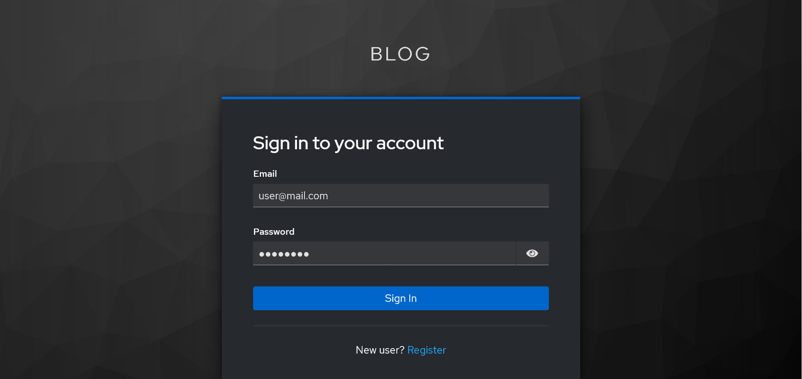
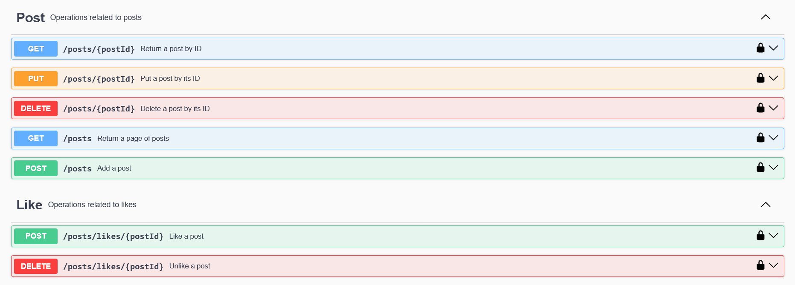
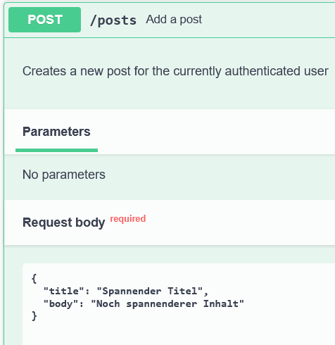
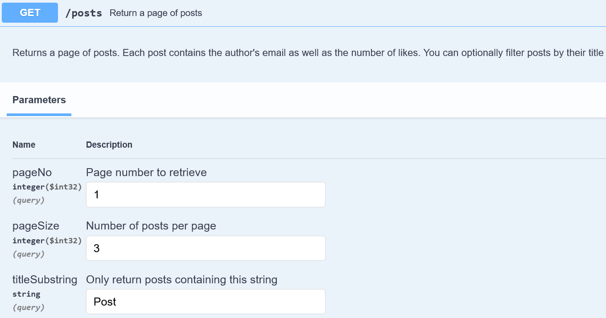
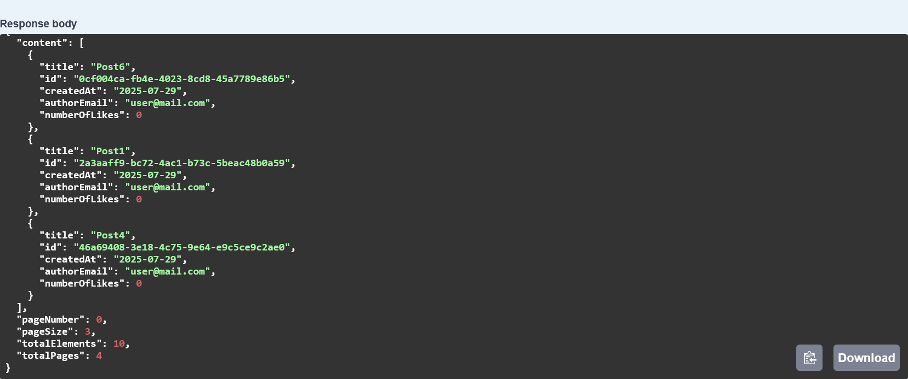
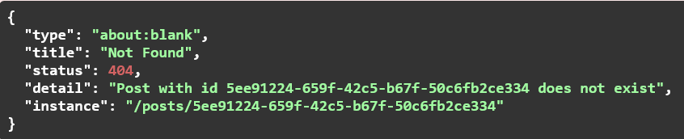

# Projekt

Simple Blogging-App, in der man Blog-Beiträge entdecken und liken kann.
## Beschreibung
Die Blogging-App hat folgende Eigenschaften
- Endpunkte und Login sind über SwaggerUI zugänglich
- Registrierung und login findet über Keycloak statt
- Blog-Beiträge (Posts) können von Nutzern erstellt werden
- Posts können aktualisiert werden
- Man kann einzelne Posts anfragen, aber auch mehrere Posts seitenweise abfragen.
- Posts können ebenfalls wieder gelöscht werden
- Man kann Posts liken und auch wieder ent-liken
- Die Anfragen werden im Backend robust überprüft. Beispielsweise kann nur der Besitzer ein Post aktualisieren oder löschen.

### Registrieren und Login über Keycloak

### SwaggerUI Endpunkte

### Beispiel für das Erstellen eines Blog-Beitrags

### Beispiel für das Anfragen von Blog-Beiträgen mit 'Post' im Titel

### Beispiel für einfaches Error-Handling beim Löschen eines nicht existierenden Post

## Verwendete Technologien
- Spring 
    - Spring Boot
    - Spring Data JPA
    - Spring Security
    - Spring Web
- Maven

